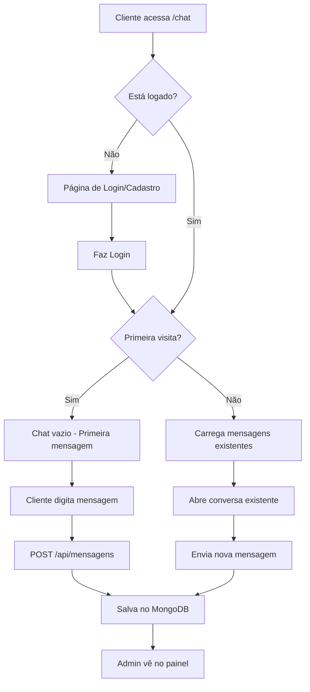
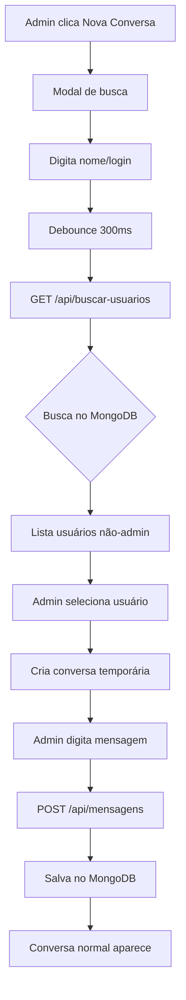

# Sistema de Mensagens - Documentação Completa

## 📋 Visão Geral
Sistema de mensagens bidirecional entre clientes e administradores da Panificadora Paraíba.

---

## 🔄 Fluxos de Iniciar Mensagem

### 1️⃣ Cliente Inicia Conversa

#### Pontos de Entrada:
1. **Página Fale Conosco** (`/fale-conosco`)
   - Link "Chat Online" → `/chat?from=fale-conosco`
2. **Header do Site**
   - Ícone de chat no menu principal
3. **Acesso Direto**
   - URL direta para `/chat`

#### Fluxo Completo:



#### Processo Técnico:

**1. Cliente acessa `/chat`**
```typescript
// src/app/chat/page.tsx (linha 24-32)
const { user } = useUser(); // Busca usuário logado
const searchParams = useSearchParams();
const fromFaleConosco = searchParams?.get('from') === 'fale-conosco';
```

**2. Carrega mensagens existentes** (se houver)
```typescript
// src/app/chat/page.tsx (linha 57-88)
const fetchMensagens = useCallback(async () => {
  if (!user) return;
  
  const response = await fetch(`/api/mensagens?userId=${user.login}`);
  const data = await response.json();
  
  if (data.success) {
    setMensagens(data.mensagens);
  }
}, [user]);
```

**3. Cliente envia primeira mensagem**
```typescript
// src/app/chat/page.tsx (linha 141-222)
const handleEnviarMensagem = async (e: React.FormEvent) => {
  const response = await fetch("/api/mensagens", {
    method: "POST",
    headers: { "Content-Type": "application/json" },
    body: JSON.stringify({
      userId: user.login,
      userName: user.name,
      mensagem: novaMensagem,
      remetente: "cliente"  // 👈 Importante
    })
  });
};
```

**4. API processa mensagem**
```typescript
// src/pages/api/mensagens.ts (linha 99-186)
if (method === "POST") {
  const { userId, userName, mensagem, remetente } = req.body;
  
  // Validações (linhas 103-151)
  // - Campos obrigatórios
  // - Tamanho máximo (1000 caracteres)
  // - Prevenção de duplicatas (2 segundos)
  
  const novaMensagem = {
    userId,
    userName,
    mensagem: mensagem.trim(),
    remetente, // "cliente" ou "admin"
    dataEnvio: agora,
    lida: false
  };
  
  await mensagensCollection.insertOne(novaMensagem);
}
```

---

### 2️⃣ Admin Inicia Conversa (Nova Funcionalidade)

#### Interface:
- **Botão**: "Nova Conversa" no painel de mensagens
- **Modal**: Busca de usuário por nome ou login

#### Fluxo Completo:



#### Processo Técnico:

**1. Admin clica "Nova Conversa"**
```typescript
// src/app/painel/mensagens/page.tsx (linha 469-473)
<button
  onClick={handleNovaConversa}
  className="..."
>
  + Nova Conversa
</button>
```

**2. Modal abre com busca**
```typescript
// src/app/painel/mensagens/page.tsx (linha 801-871)
{mostrarNovaConversa && (
  <div className="fixed inset-0 bg-black bg-opacity-50">
    <input
      type="text"
      value={buscaUsuario}
      onChange={(e) => {
        // Debounce de 300ms
        const timeout = setTimeout(() => {
          handleBuscarUsuarios(value);
        }, 300);
      }}
    />
  </div>
)}
```

**3. API busca usuários**
```typescript
// src/pages/api/buscar-usuarios.ts (linha 5-78)
export default async function handler(req: NextApiRequest, res: NextApiResponse) {
  const { q } = req.query;
  
  // Proteção contra ReDoS
  const escapedQuery = q.replace(/[.*+?^${}()|[\]\\]/g, '\\$&');
  
  const usuarios = await usuariosCollection
    .find({
      $or: [
        { login: { $regex: escapedQuery, $options: "i" } },
        { name: { $regex: escapedQuery, $options: "i" } }
      ],
      permissao: { $ne: "administrador" }
    })
    .limit(10)
    .toArray();
    
  return res.json({ success: true, usuarios });
}
```

**4. Admin seleciona usuário**
```typescript
// src/app/painel/mensagens/page.tsx (linha 367-383)
const handleSelecionarUsuario = (usuario: Usuario) => {
  const novaConversa: Conversa = {
    userId: usuario.login,
    userName: usuario.name,
    mensagens: [],
    ultimaMensagem: new Date().toISOString(),
    naoLidas: 0
  };
  
  setConversaTemporaria(novaConversa);
  setConversaSelecionada(usuario.login);
  setConversaExpandida(usuario.login);
  setMostrarNovaConversa(false);
};
```

**5. Admin envia primeira mensagem**
```typescript
// src/app/painel/mensagens/page.tsx (linha 203-268)
const handleEnviarResposta = async (e: React.FormEvent) => {
  const response = await fetch("/api/mensagens", {
    method: "POST",
    body: JSON.stringify({
      userId: conversaSelecionada,
      userName: conversaAtual?.userName || "Admin",
      mensagem: novaMensagem,
      remetente: "admin"  // 👈 Importante
    })
  });
  
  // Limpa conversa temporária após envio
  if (conversaTemporaria) {
    setConversaTemporaria(null);
  }
  
  await fetchConversas(); // Recarrega lista
};
```

---

## 🗄️ Estrutura de Dados (MongoDB)

### Collection: `mensagens`

```typescript
interface Mensagem {
  _id: ObjectId;
  userId: string;        // Login do usuário
  userName: string;      // Nome do usuário
  mensagem: string;      // Conteúdo (máx 1000 chars)
  remetente: "cliente" | "admin";
  dataEnvio: Date;
  lida: boolean;
}
```

### Exemplo de documento:
```json
{
  "_id": ObjectId("..."),
  "userId": "joao.silva",
  "userName": "João Silva",
  "mensagem": "Olá, gostaria de fazer um pedido especial!",
  "remetente": "cliente",
  "dataEnvio": ISODate("2024-01-15T10:30:00.000Z"),
  "lida": false
}
```

---

## 🔒 Segurança

### Proteções Implementadas:

1. **Autenticação obrigatória**
   - Cliente: deve estar logado para enviar
   - Admin: verificação em todas as APIs

2. **Validações de entrada**
   - Mensagem: 1-1000 caracteres
   - Tamanho de userName: máximo 100 chars
   - Tamanho de userId: máximo 100 chars
   - Prevenção de duplicatas: 2 segundos

3. **Proteção contra injeção**
   - Regex escapado na busca
   - Limite de tamanho de query (50 chars)
   - Exclusão de admins na busca

4. **Controle de acesso**
   - Cliente só vê suas mensagens
   - Cliente só envia suas mensagens
   - Admin vê todas as conversas

---

## 📊 API Endpoints

### GET `/api/mensagens`
**Descrição**: Busca mensagens

**Query Params:**
- `userId`: ID do usuário (cliente)
- `isAdmin=true`: Lista todas conversas (admin)

**Respostas:**
```typescript
// Cliente
{ success: true, mensagens: Mensagem[] }

// Admin
{ success: true, conversas: Conversa[] }
```

---

### POST `/api/mensagens`
**Descrição**: Envia nova mensagem

**Body:**
```typescript
{
  userId: string;
  userName: string;
  mensagem: string;
  remetente: "cliente" | "admin";
}
```

**Respostas:**
```typescript
{ 
  success: true, 
  mensagemId: string,
  mensagem: Mensagem 
}
```

---

### PUT `/api/mensagens`
**Descrição**: Marca mensagens como lidas

**Body:**
```typescript
{
  userId: string;
  marcarComoLida: true;
  isAdmin: boolean;  // Se é admin marcando
}
```

---

### DELETE `/api/mensagens`
**Descrição**: Deleta conversa ou mensagem

**Query Params:**
- `userId`: Deleta todas mensagens do usuário
- `mensagemId`: Deleta mensagem específica

---

### GET `/api/buscar-usuarios`
**Descrição**: Busca usuários (apenas admin)

**Query Params:**
- `q`: Query de busca (máx 50 chars)

**Respostas:**
```typescript
{
  success: true,
  usuarios: [
    { _id: string, login: string, name: string }
  ]
}
```

---

## 🎨 Interface do Usuário

### Cliente (`/chat`)
- Chat simples com histórico
- Mensagens do cliente à direita (ânbar)
- Mensagens do admin à esquerda (branco)
- Contador de caracteres (máx 500)
- Indicador de horário
- Polling automático a cada 30s

### Admin (`/painel/mensagens`)
- Lista de conversas expansível
- Preview da última mensagem
- Contador de não lidas
- Busca de usuários
- Nova conversa
- Botão de deletar conversa
- Link para perfil do cliente
- Scroll automático
- Polling inteligente (só quando visível)

---

## 🔔 Notificações

### Sistema de Contadores:
```typescript
// Quando nova mensagem é enviada
window.dispatchEvent(new Event('refreshMensagensCount'));

// Header escuta o evento e atualiza contador
// src/components/Header/index.tsx
```

---

## 🚀 Melhorias Futuras

1. ✅ Busca de usuários
2. ✅ Nova conversa pelo admin
3. ✅ Proteção contra duplicatas
4. ✅ Validações robustas
5. ✅ Prevenção de ReDoS
6. ⏳ Notificações push
7. ⏳ Upload de imagens
8. ⏳ Histórico com paginação
9. ⏳ Busca de mensagens
10. ⏳ Exportação de conversas

---

## 📝 Notas Técnicas

### Debounce na Busca:
- 300ms de delay
- Limpa timeout anterior
- Evita requisições excessivas

### Polling Inteligente:
- Só quando página está visível
- Pausa quando aba está escondida
- Reinicia quando volta a ser visível
- 30 segundos de intervalo

### Scroll Automático:
- Só em conversas expandidas
- Delay de 100-200ms
- Comportamento suave

### Conversa Temporária:
- Criação local (não salva no DB)
- Limpa após primeira mensagem
- Permite ver preview antes de enviar

---

## 🐛 Problemas Conhecidos e Soluções

### 1. Duplicatas
**Problema**: Mensagens duplicadas em 2 segundos  
**Solução**: Verificação no POST da API (linhas 153-168)

### 2. Busca lenta
**Problema**: Regex sem escape  
**Solução**: Escape de caracteres especiais (linha 42)

### 3. Acesso não autorizado
**Problema**: Cliente acessa mensagens de outros  
**Solução**: Verificação de userId em todas as rotas

### 4. Memory leak no polling
**Problema**: Interval não é limpo  
**Solução**: Cleanup no useEffect (linhas 147-154)

---

## 📞 Contato e Suporte

Para dúvidas sobre o sistema de mensagens:
- Documentação completa: Este arquivo
- Issues: Repositório Git
- Suporte técnico: [Email do projeto]

---

**Última atualização**: Janeiro 2024  
**Versão**: 1.0.0  
**Autor**: Sistema de Desenvolvimento


